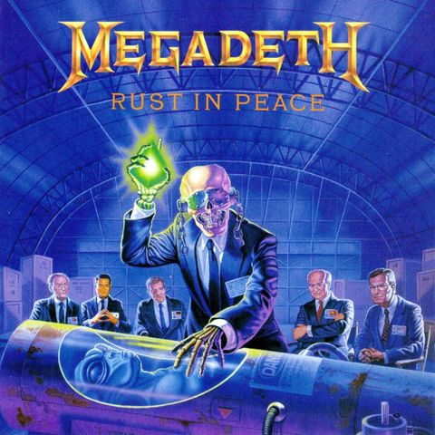

### Line-up

*   [**Ronan** Limon Duparcmeur](mailto://ronan@2-45.pm)
*   [@r3trofitted](https://twitter.com/r3trofitted)
*   https://github.com/r3trofitted
*   [**Keycoopt**](https://www.keycoopt.com)

--

`https://open.spotify.com/user/keycoopt/playlist/03ashZEH20BVRyt55wG1Gu`

--

`https://itunes.apple.com/fr/playlist/megadeth-1986..2016/idpl.04082f16b4ee42a0a189f37014862912`

---
class: middle, center

.center[]

---
class: album-cover

```
 |\   /|  __  __    _   __   __  ___  |   |
 | \ / |  |_  | _  /_\  | \  |_   |   |---|
 |     |  |_  |_| /   \ |_/  |_   |   |   |
 /                                          \
```

???

---
class: album-cover


> How we see Dave

---
class: album-cover


> How Dave sees us

---
class: album-cover


---

## 1. Deal with your problems head-on (don't be a jerk like Lars and James)

---
class: middle

.large[`$ bin/rake notes`]

--

.large[`$ bin/rake notes | grep FIXME | wc -l`]

---
class: album-cover


---

## 2. Don't waste half your budget on drugs and booze

---
class: middle, center

Business value > Fun

--

Team momentum > Fun

---
class: album-cover


---

## 3. Spare others your confusing comments

---

```ruby
# Le nom de famille est souvent répété et prend de la place
# dans les crédit des compos
def booklet_name
  [first_name, last_name.sub(/(?<=\w).+/, ".")].compact.join(" ")
end
```

???

Surtout en Ruby, où tout est facilement expressif

--

```ruby
# Garde le prénom mais ne garde que l'initiale du nom de famille.
# P.ex. "Dave Mustaine" devient "Dave M."
def display_name
  [first_name, last_name.sub(/(?<=\w).+/, ".")].compact.join(" ")
end
```

--

```ruby
def display_name
  [first_name, last_name_initial].compact.join(" ")
end
```

---

```ruby
%w(year mon month day mday wday yday hour min sec usec nsec to_date).each do |method_name|
  class_eval <<-EOV, __FILE__, __LINE__ + 1
    def #{method_name}    # def month
      time.#{method_name} #   time.month
    end                   # end
  EOV
end
```

---
class: album-cover



---
class: center, middle

<iframe width="560" height="315" src="https://www.youtube.com/embed/9d4ui9q7eDM" frameborder="0" allowfullscreen></iframe>

---

## 4. Code **tight** and **sharp**

---

```ruby
def search(query, base = nil)
  results = local_search(query, base)
  seen = results.map(&:full_name).to_set

  @sources.each do |source|
    source.search(query, base).each do |spec|
      results << spec if seen.add?(spec.full_name)
    end
  end

  sort_specs(results)
end
```

---

## Sandi Metz' rules

1.  Classes can be no longer than 100 lines of code.
2.  Methods can be no longer than 5 lines of code.
3.  Pass no more than 4 parameters into a method. Hash options are parameters.
4.  Controllers can instantiate only 1 object.

---

1.  **Classes can be no longer than 100 lines of code.**
2.  **Methods can be no longer than 5 lines of code.**
3.  Pass no more than 4 parameters into a method. Hash options are parameters.
4.  Controllers can instantiate only 1 object.

---

```ruby
  def build_extensions # :nodoc:
    return if default_gem?
    return if extensions.empty?
    return if installed_by_version < Gem::Version.new('2.2.0.preview.2')
    return if File.exist? gem_build_complete_path
    return if !File.writable?(base_dir)
    return if !File.exist?(File.join(base_dir, 'extensions'))

    begin
      # We need to require things in $LOAD_PATH without looking for the
      # extension we are about to build.
      unresolved_deps = Gem::Specification.unresolved_deps.dup
      Gem::Specification.unresolved_deps.clear

      require 'rubygems/config_file'
      require 'rubygems/ext'
      require 'rubygems/user_interaction'

      ui = Gem::SilentUI.new
      Gem::DefaultUserInteraction.use_ui ui do
        builder = Gem::Ext::Builder.new self
        builder.build_extensions
      end
    ensure
      ui.close if ui
      Gem::Specification.unresolved_deps.replace unresolved_deps
    end
  end
```

---

```ruby
def test_class_load_plugins
  loaded, = Hoe.load_plugins
  
  assert_includes loaded.keys, :package
  assert_includes loaded.keys, :publish
  assert_includes loaded.keys, :test
  end
end
```

---
class: album-cover


???
*   Plein de styles
    *   Blues : Use the Man
    *   Pop : I'll get even, Sin
    *   Punk/speed metal : FFF
    *   Hard rock : Almost Honest
    *   Heavy metal : She-Wolf

---

## 5. Don't bother caring about labels

---
class: picture


???

*   Rails encourage ça
*   C'est nul (cf. Uncle Bob)
*   Mais c'est pas obligatoire

---
class: picture


---
class: album-cover


---

## 6. … but don't push it too far

---
class: middle, center

.large[{insérer ici une image de ActiveRecord implémenté en PHP 4}]

---
class: picture


---

## 7.  There's always a better shredder, there's only one Junior

---
class: picture


---
class: middle

> In our life, there is _if_  
> In our belief, there is _lie_  
> In our business, there is _sin_  
> In our bodies, there is _die_

--

> Military intelligence, two words combined that can't make sense

---

## 8. Sharpen your words and your wit

---
class: middle, center

`http://www.wordsmith.org/anagram/advanced.html`

---
class: picture


---

## 9. Don't rant incomprehensibly

---
class: picture


---
class: middle

*   https://git-scm.com/book/ch5-2.html
*   https://robots.thoughtbot.com/5-useful-tips-for-a-better-commit-message

---
class: picture


---
class: middle

.large[`$ git rebase master`]

--

.large[`$ git rebase -interactive master`]  
.large[`$ git merge --no-ff feature_branch`]

--

.large[`$ git rebase -interactive -preserve-merges master`]

---

## 10. Take sides (and take no shit)

---
class: middle

Opinionated frameworks and tools

--

Inclusiveness

--

Irreverence

---
class: middle

### More?

Neutrality is cowardice


# Set list

1.  Deal with your problems head-on (don't be a jerk like Lars and James)
2.  Don't waste half your budget on drugs and booze
3.  Spare me your confusing comments
4.  (Code) **Tight** and **sharp**
5.  Don't bother caring about labels
6.  … but don't push it too far
7.  There's always a better shredder, there's only one Junior
8.  Sharpen your words and your wit
9.  Don't rant incomprehensibly
10. Take sides (and take no shit)

---

## Bonus tracks

---

## 11. Almost honest (in your estimates)

---

## 12. Grit & no drama
